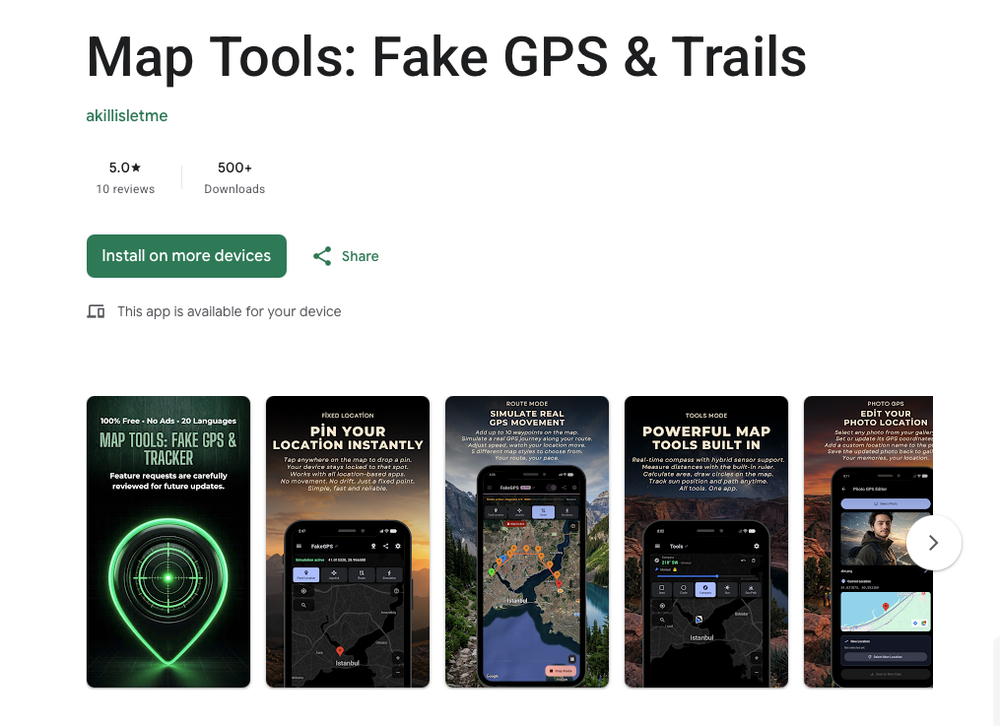

# Map Tools: Fake GPS & Tracker [Open source]



[View Screenshots](docs/screenshots.md)

- **App adı:** Map Tools: Fake GPS & Tracker
- **App url:** [Google Play](https://play.google.com/store/apps/details?id=com.akillisletme.locationsimulator)
- **Developer:** [akillisletme](https://github.com/akillisletme)
- **Platform:** Flutter (Android)
- **Repository:** [github.com/akillisletme/fake_gps_public](https://github.com/akillisletme/fake_gps_public)

## Genel Görüş

Map Tools: Fake GPS & Tracker, Android cihazlarda GPS konumunu simüle etmek için
geliştirilmiş kapsamlı bir geliştirici aracıdır. Root gerektirmez. Harita ekranı
**üç üst moddan** oluşur:

```
FakeGPS (simülasyon)  ⇄  Araçlar (ölçüm/analiz)  ⇄  Tracker (gerçek GPS kaydı)
```

- **FakeGPS** — 5 simülasyon modu: sabit konum, joystick, rota, çok noktalı
  gelişmiş rota, insan simülasyonu
- **Araçlar** — 10 ölçüm/analiz aracı; metrik, emperyal ve denizcilik birimleri
- **Tracker** — gerçek yürüyüşünü kaydet, sonra simülasyon olarak yeniden oynat;
  ısı haritası, rakım profili ve iz takibi

Reklamsız ve 20 dil desteğiyle sunulur. 5 simülasyon modunun tamamı, yürüyüş
kaydı ve 10 aracın hepsi **günlük bir kullanım hakkı** dâhilinde ücretsizdir;
isteğe bağlı premium günlük hakkı kaldırır ve ek özellikleri açar
(ayrıntı: [Features](docs/features.md)).

## Teknik Görüş

Flutter (Dart) ile geliştirilmiştir; state yönetimi BLoC/Cubit, navigasyon
GoRouter, kalıcılık Drift (SQLite) + SharedPreferences, yerelleştirme
EasyLocalization ile yapılır. Harita ekranı **presenter + registry** deseniyle
kurgulanmıştır: yeni bir üst mod eklemek ekran kabuğuna dokunmayı gerektirmez.

Native Kotlin tarafında ForegroundService ile GPS enjeksiyonu yapılmakta; hem
FusedLocationProviderClient hem de legacy LocationManager (GPS + Network)
desteklenmektedir. Bu sayede modern ve eski tüm uygulamalarla uyumluluk
sağlanmaktadır. Uygulama kapalıyken de çalışan dört giriş noktası vardır:
home widget, floating overlay, zamanlanmış alarm ve Smart Shield.

---

## Pages

- [Features](docs/features.md) — What the app can do
- [Architecture](docs/architecture.md) — Technical overview
- [Setup Guide](docs/setup.md) — How to get started
- [Screenshots](docs/screenshots.md) — App screenshots

---

## Links

| | |
|---|---|
| Website | https://akillisletme.com/tr |
| Instagram | https://www.instagram.com/akillisletme/ |
| TikTok | https://www.tiktok.com/@akillisletme |
| GitHub | https://github.com/akillisletme |
| Email | akillisletme@gmail.com |
